# Report

## Table of Contents

- [Part 1](#part-1)
- [Part 2](#part-2)
- [Part 3](#part-3)
  - [Control Flow Graph of _to_roman_](#control-flow-graph-of-_to_roman_)
  - [Cyclomatic Complexity](#cyclomatic-complexity)
    - [DD-Path](#dd-path)
    - [Computation](#computation)
  - [Independent Paths](#independent-paths)
  - [DU-pairs](#du-pairs)
  - [Unit Tests for Branch Coverage](#unit-tests-for-branch-coverage)
- [Part 4](#part-4)
  - [Integration Test](#integration-test)
  - [Execution Result](#execution-result)
  - [Integration Finding](#integration-finding)
- [Part 5](#part-5)
  - [Acceptance Criteria](#acceptance-criteria)
  - [Acceptance Tests](#acceptance-tests)
  - [Execution Result](#execution-result-1)
  - [Why AC1 and AC2 Failed, and Why Coverage Cannot Reveal Defects of This Kind](#why-ac1-and-ac2-failed-and-why-coverage-cannot-reveal-defects-of-this-kind)
- [Part 6](#part-6)
  - [Defect 1: found by the integration test (Part 4)](#defect-1-found-by-the-integration-test-part-4)
  - [Defect 2: found by acceptance criterion AC1 (Part 5)](#defect-2-found-by-acceptance-criterion-ac1-part-5)
  - [Defect 3: found by acceptance criterion AC2 (Part 5)](#defect-3-found-by-acceptance-criterion-ac2-part-5)
  - [Final Test Run](#final-test-run)
  - [Final Coverage](#final-coverage)

## Part 1

The project was forked, cloned, and set up in a virtual environment. The inherited test suite was run first, confirming that all 15 existing tests pass, and the command-line conversion was exercised manually before writing any test.

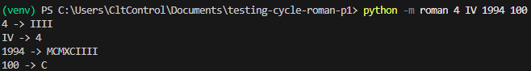

## Part 2

Before writing new tests, the initial branch coverage of `src/roman/converter.py` was measured to establish a baseline. As expected, coverage starts at 64%, since the inherited suite only exercises the base conversion cases.

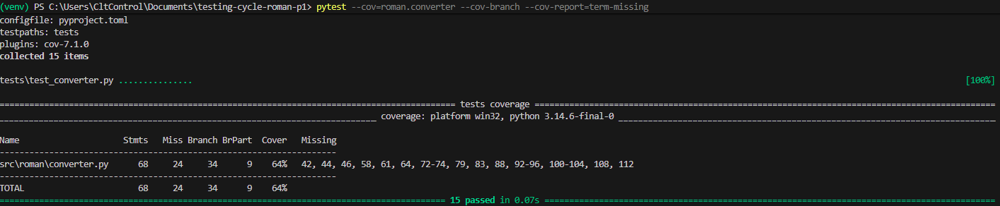

## Part 3

### Control Flow Graph of _to_roman_

This section applies path testing to the `to_roman` function (lines 40 to 53 of `src/roman/converter.py`). Path testing derives a program graph from the source code, where nodes represent statements (or blocks of sequential statements) and edges represent the flow of control between them. This graph is then used to compute the cyclomatic complexity and to derive a basis set of independent paths.

Note that the _to_roman_ function is:
```python {.line-numbers}
def to_roman(n):
    if not isinstance(n, int) or isinstance(n, bool):
        raise RomanError("value must be an integer")
    if n < _MIN_VALUE:
        raise RomanError("value must be >= 1")
    if n > _MAX_VALUE:
        raise RomanError("value must be <= 3999")
    out = []
    remaining = n
    for value, symbol in _PAIRS:
        while remaining >= value:
            out.append(symbol)
            remaining -= value
    return "".join(out)

```

Each node corresponds to a statement (or a sequential block of statements) of `to_roman`, and each edge represents a possible transfer of control between them. So, the resulting CFG is:

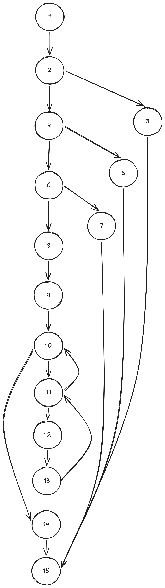{ width=300 }

### Cyclomatic Complexity

#### DD-Path

Before computing the cyclomatic complexity, the CFG is reduced to its decision-to-decision path (DD-Path) graph. In a DD-Path graph, every maximal chain of sequential nodes (nodes with exactly one predecessor and one successor) is collapsed into a single node, so that only the decision points and junctions of the original CFG remain visible. This simplifies the counting of edges and nodes used in the cyclomatic complexity formula, while preserving the same set of possible execution paths as the original CFG.

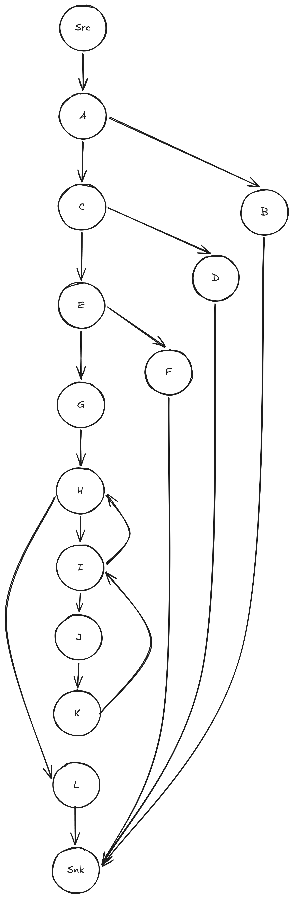{ width=300 }

#### Computation

Thanks to the DD-Path, we can get the exact number of independent paths. The formula is:

V(G) = E - N + 2P

Where:
- E = number of edges in the control flow graph
- N = number of nodes in the control flow graph
- P = number of connected components in the control flow graph

Then, we get:

- E = 18 (edges)
- N = 14 (nodes)
- P = 1 (connected component)

Finally:

V(G) = 18 - 14 + 2*1 = 6

This means six linearly independent paths are needed to cover every decision outcome of `to_roman` at least once.

### Independent Paths

Below is a basis set of V(G) = 6 linearly independent paths through `to_roman`, each highlighted over the DD-Path graph and written as a sequence of nodes:

- Independent Path 1
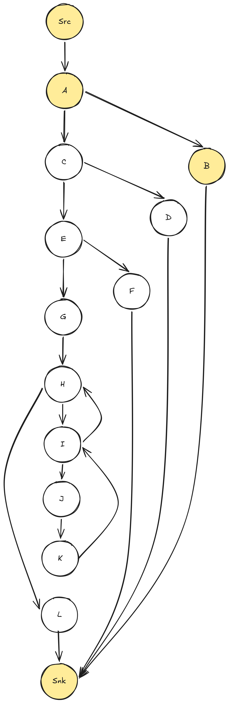{ width=300 }

- Independent Path 2
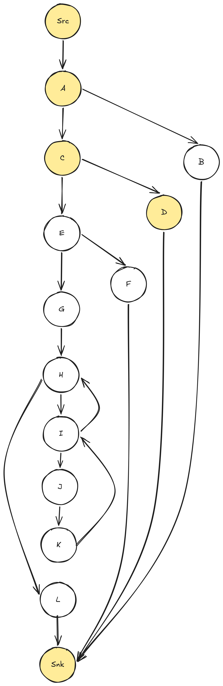{ width=300 }

- Independent Path 3
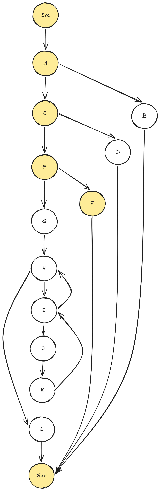{ width=300 }

- Independent Path 4
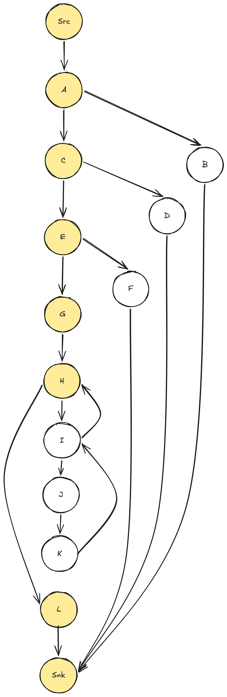{ width=300 }

- Independent Path 5
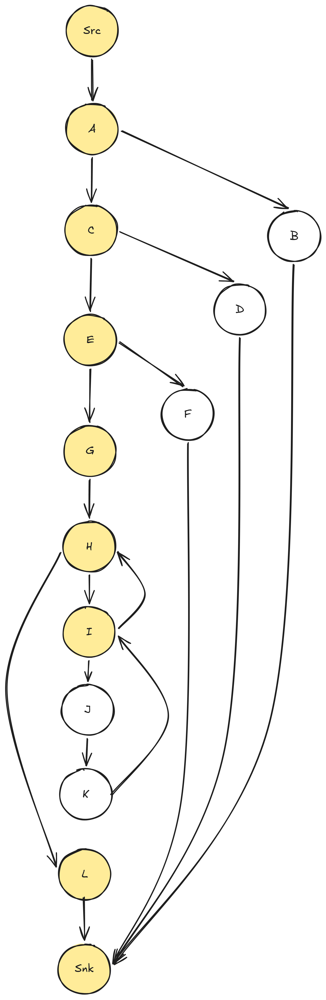{ width=300 }

- Independent Path 6
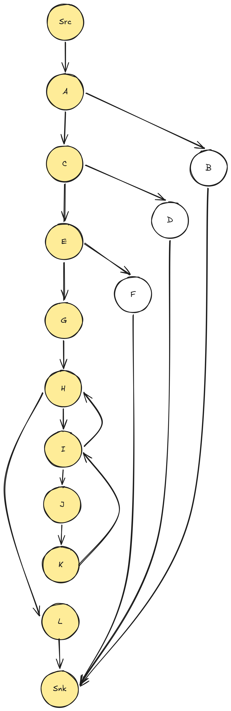{ width=300 }

### DU-pairs

The table below lists the definition-use pairs for each variable of `to_roman`, classifying each use as a computational use (c-use, when the variable's value is used to compute another value or is passed as an argument) or a predicate use (p-use, when the variable's value is used directly inside a decision's condition). The variable `remaining` is redefined on every iteration of the `while` loop, so the pairs created by that redefinition (9 -> 11, 9 -> 13, 13 -> 11, 13 -> 13) are included as well.

| Definition -> Use Pair (start line -> end line) | c-use     | p-use     |
|-----------------------------------------------|-----------|-----------|
| 1 -> 2                                        | n         |           |
| 1 -> 4                                        |           | n         |
| 1 -> 6                                        |           | n         |
| 1 -> 9                                        | n         |           |
| 8 -> 12                                       | out       |           |
| 8 -> 14                                       | out       |           |
| 9 -> 13                                       | remaining |           |
| 9 -> 11                                       |           | remaining |
| 10 -> 11                                      |           | value     |
| 10 -> 12                                      | symbol    |           |
| 10 -> 13                                      | value     |           |
| 12 -> 12                                      | out       |           |
| 12 -> 14                                      | out       |           |
| 13 -> 11                                      |           | remaining |
| 13 -> 13                                      | remaining |           |

### Unit Tests for Branch Coverage

Using the independent paths and the DU-pairs above as a guide, 15 new unit tests were added to `tests/test_converter.py` (the 15 inherited tests were left unmodified). The new tests target the branches that part 2 reported as missing: the three guard clauses of `to_roman` (non-integer input, boolean input, value below the minimum, value above the maximum), the guard clauses and subtractive-pair handling of `from_roman` (non-string input, empty string, invalid character, valid and invalid subtractive pairs, out-of-range totals), both outcomes of `is_valid_roman`, and the internal helpers `_count_char` and `_roundtrip_differs`.

The functions `add_roman` and `subtract_roman` were deliberately left uncovered at this stage, since they are the collaboration under test in Part 4 (integration level).

Running the coverage command again after adding the tests:

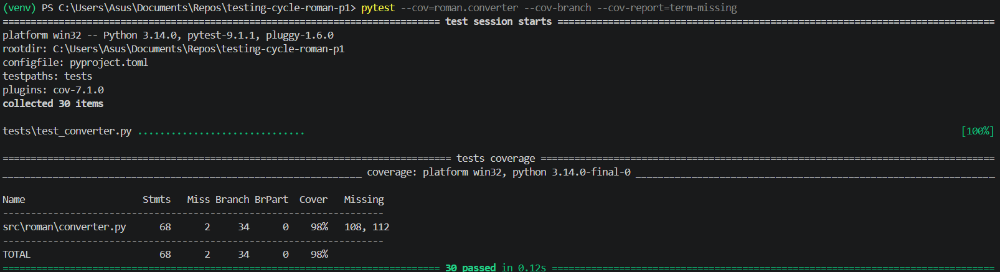

Branch coverage of `src/roman/converter.py` went from 64% (Part 2) to 98%, above the 85% required by this task. All 30 tests (15 inherited + 15 new) pass.

## Part 4

### Integration Test

`add_roman` and `subtract_roman` do not implement any conversion logic themselves: they are built entirely on top of `from_roman` and `to_roman` (`SPECIFICATION.md`, section 7), and their result is expected to be a canonical roman numeral that `is_valid_roman` accepts. The unit tests written in Part 3 exercise `from_roman`, `to_roman` and `is_valid_roman` in isolation; none of them exercise the collaboration between all of these units through `add_roman`/`subtract_roman`.

Five integration tests were added in a new file, `tests/test_integration.py`, using the mandatory examples from section 7 of the specification:

```python
from roman.converter import add_roman, subtract_roman, is_valid_roman


def test_add_roman_two_plus_two():
    assert add_roman("II", "II") == "IV"


def test_add_roman_subtractive_operands():
    assert add_roman("IV", "VI") == "X"


def test_add_roman_across_thousands():
    assert add_roman("MCMXCIV", "VI") == "MM"


def test_subtract_roman_ten_minus_one():
    assert subtract_roman("X", "I") == "IX"


def test_add_roman_result_is_accepted_by_is_valid_roman():
    assert is_valid_roman(add_roman("IV", "VI")) is True
```

### Execution Result

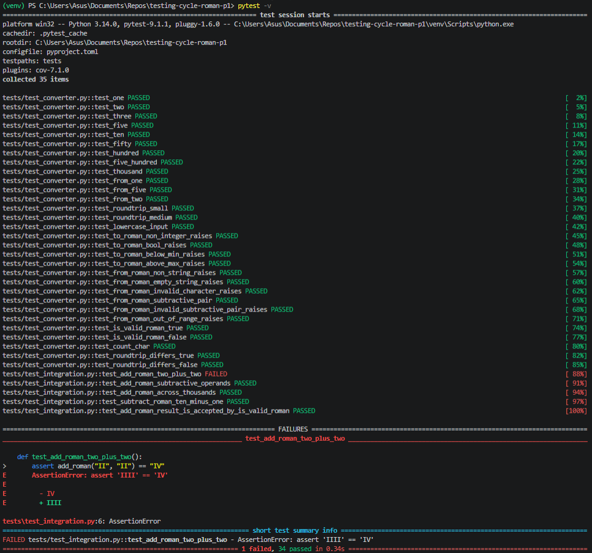

### Integration Finding

`add_roman("II", "II")` returns `"IIII"` instead of the canonical `"IV"` required by the specification. The root cause is in the `_PAIRS` table used by `to_roman`:

```python
_PAIRS = (
    ...
    (5, "V"),
    (5, "IV"),   # should be (4, "IV")
    (1, "I"),
)
```

The entry for the subtractive symbol `"IV"` is keyed to the value `5` instead of `4`, duplicating the entry for `"V"`. Because `to_roman` walks `_PAIRS` in order and only emits a symbol while `remaining >= value`, a `remaining` of `4` never reaches the `(5, "IV")` branch (`4 >= 5` is false) and falls through to `(1, "I")`, which is appended four times.

**Why the unit tests of each function pass without detecting it:**

- The 15 inherited `to_roman` unit tests, and the ones added in Part 3, call `to_roman` with `1, 2, 3, 5, 7, 10, 50, 58, 100, 500, 1000`, plus the boundary/type-error inputs `0`, `4000`, `"10"`, `True`. None of these values has a units digit of `4`, so none of them ever drives `remaining` to exactly `4` inside the loop. Branch coverage of `to_roman` is at 100% because every `if`, `for` and `while` branch is exercised, but coverage only proves a branch executed, not that it executed with the specific value (`4`) that exposes this data-table defect. This is precisely why 85%+ branch coverage does not guarantee correctness.
- `from_roman`, tested on its own, is correct and unrelated to `_PAIRS`: `from_roman("IV")` uses `_SINGLE`/`_VALID_SUBTRACTIVE` and correctly returns `4`. A unit test for `from_roman` alone cannot reveal a defect that lives inside `to_roman`.
- The defect only surfaces when a value of `4` is *produced* by composing two units, `from_roman("II") + from_roman("II")`, and immediately *consumed* by `to_roman`. That specific composition is exactly what the integration test performs, following the worked example mandated by the specification (`add_roman("II", "II") == "IV"`), which is why it takes an integration-level test, not more unit tests of the individual functions, to catch it.

This defect is left unfixed at this point in the workshop; it will be addressed in Part 6 together with the other defects, without modifying the 15 inherited tests.

## Part 5

### Acceptance Criteria

The following three criteria are functional: they are taken directly from `SPECIFICATION.md`, without looking at the implementation of `src/roman/converter.py`.

**AC1: Whitespace tolerance (`SPECIFICATION.md`, section 3)**

> Given a roman numeral string with leading and trailing whitespace, `"  IV  "`
> When `from_roman` is called with that string
> Then it returns `4`, with the surrounding whitespace trimmed before processing

**AC2: Canonical form validation (`SPECIFICATION.md`, section 4)**

> Given a well-formed but non-canonical roman numeral string, `"IIII"` (the canonical form of 4 is `"IV"`)
> When `is_valid_roman` is called with that string
> Then it returns `False`

**AC3: Roman arithmetic result range (`SPECIFICATION.md`, section 7)**

> Given two equal roman numerals, `"I"` and `"I"`
> When `subtract_roman` is called with them
> Then it raises `RomanError`, since the result (`0`) falls outside the supported range of 1 to 3999

### Acceptance Tests

Each criterion was implemented as a test in a new file, `tests/test_acceptance.py`:

```python
import pytest

from roman.converter import from_roman, is_valid_roman, subtract_roman, RomanError


def test_from_roman_trims_surrounding_whitespace():
    assert from_roman("  IV  ") == 4


def test_is_valid_roman_rejects_non_canonical_form():
    assert is_valid_roman("IIII") is False


def test_subtract_roman_rejects_out_of_range_result():
    with pytest.raises(RomanError):
        subtract_roman("I", "I")
```

### Execution Result

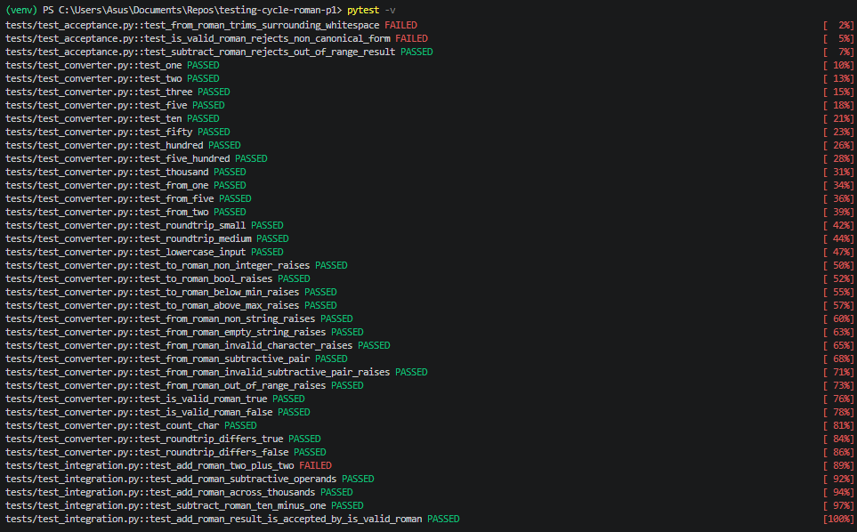

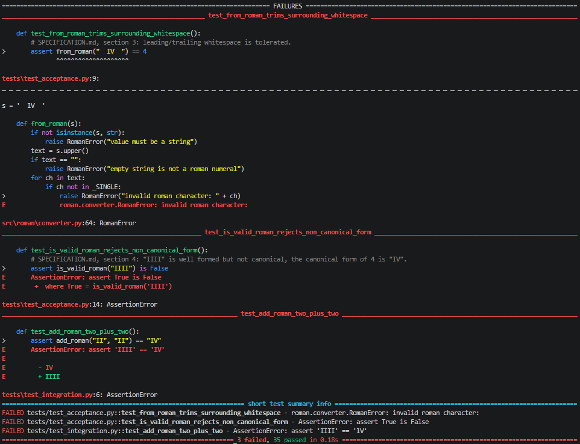


### Why AC1 and AC2 Failed, and Why Coverage Cannot Reveal Defects of This Kind

At this point in the workshop, `src/roman/converter.py` already has 98% branch coverage (Part 3) and a passing unit-level suite. Two of the three acceptance criteria still fail, revealing two defects that are structurally invisible to coverage-driven unit testing:

- **AC1 (whitespace trimming).** `from_roman` never calls `.strip()` on its input; it only calls `.upper()`. Because no line of code attempts to trim whitespace, there is no branch to exercise, cover, or miss; coverage tooling can only report on statements and branches that exist in the source. A missing statement produces no uncovered line for `pytest --cov` to flag: from `to_roman`/`from_roman`'s point of view, a space is simply "a character not in `_SINGLE`", so it takes the same, already-covered `raise RomanError("invalid roman character: ...")` branch that a genuinely invalid input like `"Z"` takes. High branch coverage tells us every existing decision was tried both ways; it says nothing about behaviour the specification requires that was never coded at all. Only a black-box test built from the specification, not from the code, can catch that a feature is absent.
- **AC2 (canonical form validation).** Section 4 of the specification requires `is_valid_roman` (and, indirectly, `from_roman`) to reject well-formed but non-canonical strings such as `"IIII"`. The current implementation has no notion of canonical form at all: `from_roman` only checks that each character is a valid symbol and that subtractive pairs are among the six allowed ones, then sums the values. There is no code path anywhere that counts repeated symbols or checks group ordering, so, again, there is nothing for coverage to miss. `is_valid_roman("IIII")` takes the normal, fully-covered success path through `from_roman` and returns `True`. This also explains why the integration test in Part 4 could not have caught this on its own: `add_roman`'s "must be accepted by `is_valid_roman`" consistency check (`SPECIFICATION.md`, section 7) is not a reliable oracle here, because `is_valid_roman` shares the same missing-canonical-check defect and would have silently accepted a non-canonical result too.

AC3 passes because `subtract_roman` already relies on `to_roman`'s existing `n < _MIN_VALUE` guard, which was written and unit-tested; there was no missing behaviour for the specification to expose.

In summary, unit and integration tests can only be as good as the branches that exist in the source code to exercise. Requirements that were never implemented leave no trace for a coverage report, which is exactly why the workshop requires acceptance criteria taken independently from the specification, not from the code.

## Part 6

Three defects were fixed, one per commit, each stating in its message the level of testing that found it. The 15 inherited tests in `tests/test_converter.py` were not modified.

### Defect 1: found by the integration test (Part 4)

**Commit `9672927`: `fix(integration): Correct value of subtractive pair IV in _PAIRS per spec section 2`**

`_PAIRS` keyed the subtractive symbol `"IV"` to the value `5`, duplicating the entry for `"V"`, instead of `4`:

```python
    (5, "V"),
-   (5, "IV"),
+   (4, "IV"),
    (1, "I"),
```

With this fix, `to_roman` reaches the `"IV"` branch whenever `remaining == 4`, so `add_roman("II", "II")` now returns `"IV"` as required by `SPECIFICATION.md`, section 2.

### Defect 2: found by acceptance criterion AC1 (Part 5)

**Commit `72e964f`: `fix(acceptance): trim leading and trailing whitespace in from_roman per spec section 3`**

`from_roman` normalized case but never trimmed whitespace:

```python
-   text = s.upper()
+   text = s.strip().upper()
```

With this fix, `from_roman("  IV  ")` returns `4`, as required by `SPECIFICATION.md`, section 3.

### Defect 3: found by acceptance criterion AC2 (Part 5)

**Commit `1296e16`: `fix(acceptance): reject non-canonical roman numerals in from_roman per spec section 4`**

`from_roman` had no notion of canonical form: it accepted any well-formed string (e.g. `"IIII"`, `"VIIII"`, `"XXXX"`, `"VV"`) as long as the characters and adjacent subtractive pairs were individually valid. A canonical-form check was added, applied directly to the trimmed and upper-cased text, right after the character-validity check and before the string is parsed into a numeric total:

```python
import re
...
_CANONICAL_PATTERN = re.compile(
    r"^M{0,3}(CM|CD|D?C{0,3})(XC|XL|L?X{0,3})(IX|IV|V?I{0,3})$"
)
...
def from_roman(s):
    ...
    for ch in text:
        if ch not in _SINGLE:
            raise RomanError("invalid roman character: " + ch)
+   if not _CANONICAL_PATTERN.match(text):
+       raise RomanError("value is not in canonical roman numeral form: " + text)
    total = 0
    ...
```

This regex encodes the five formal rules of `SPECIFICATION.md`, section 4 directly as a structural/textual pattern (at most three repeated `I`/`X`/`C`/`M` in a row, at most one `V`/`L`/`D`, only the six allowed subtractive pairs, non-increasing group values, and nothing following a subtractive pair that is not strictly smaller than the subtracted symbol), it does not call `to_roman` or `from_roman`'s own parsing as an oracle, per the explicit warning in the specification. With this fix, `is_valid_roman("IIII")` now returns `False`, as required by section 4.

**Side effect on coverage.** Because the canonical check now rejects any string that would previously have reached the parsing loop's own `"invalid subtractive pair"` and `"value out of range 1..3999"` raises (e.g. `"IC"` and `"MMMM"` are now rejected earlier, by the canonical-form check, before ever reaching those two lines), those two defensive checks became unreachable dead code. This is why final branch coverage below is 96% instead of 98%: two lines that are still correct and harmless to keep, as a defensive fallback, can no longer be exercised by any input, since the canonical check already filters everything they used to catch.

### Final Test Run

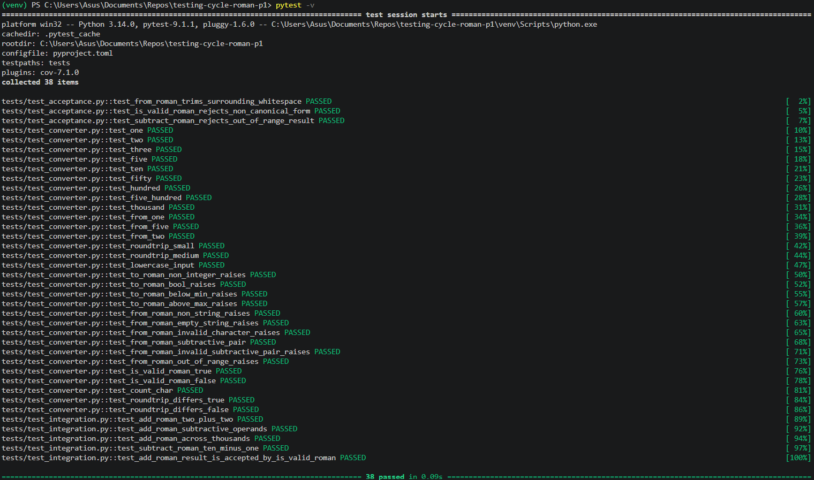

All 38 tests pass: the 15 inherited tests, the 15 unit tests from Part 3, the 5 integration tests from Part 4, and the 3 acceptance tests from Part 5.

### Final Coverage

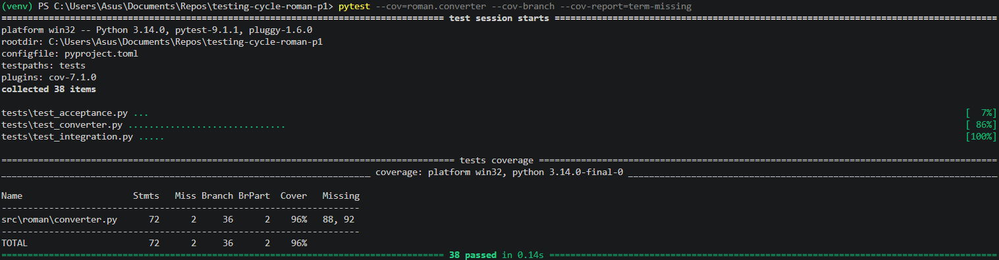

Branch coverage of `src/roman/converter.py` went from 64% (Part 2) to 96% (final), staying above the 85% threshold required by Part 3 throughout. The two remaining uncovered lines are the dead defensive checks explained above, not missing test coverage of reachable behaviour.